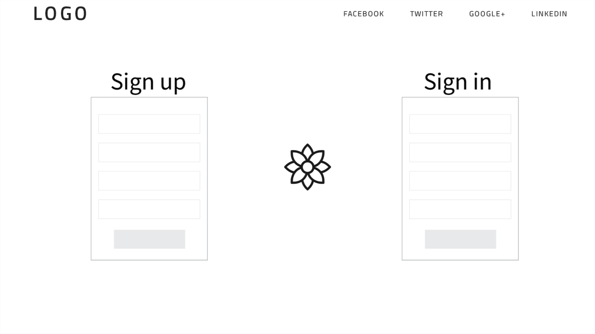
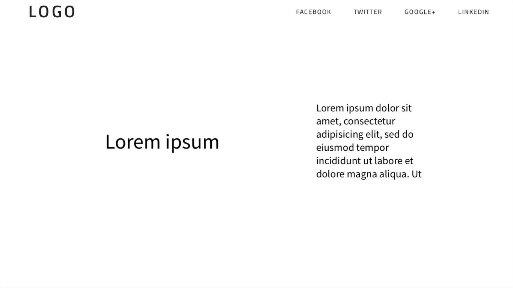
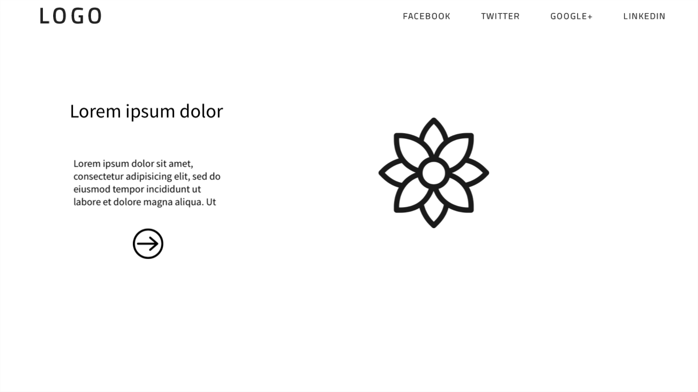
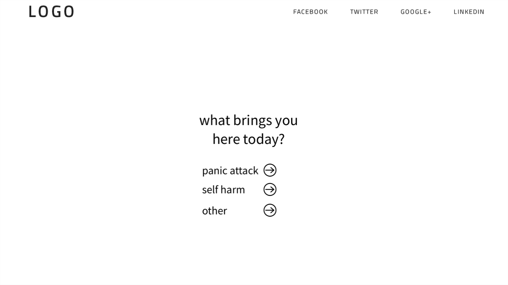

# Capstone Project: Self Care Application

## Planning for the project:
https://trello.com/b/5WLVHG2A/p4

## Wireframes:

## User Stories:
1. User suffers with their mental health, comes to site and is prompted with a question asking how they're feeling
2. User answers that they're seeking help, need to calm down, or are just browsing
3. User can choose to do exercises that will help to level them out
4. User can choose to sign in or sign up, and connect with another user for support
5. User can go back and work on excercises as needed, regardless of how they're feeling.

## Sprints

### Sprint 1
- Initial front end and back ends are created and functioning on their own
- User can see nav and basic information on front end
- Ruby is connected to Rails server and postgres db
- MVC is created in Ruby
- Init Styling

### Sprint 2
- User can sign in and sign up for an account
- User can delete their account, update their username, etc (CRUD functionality)
- Frontend connected to Backend

### Sprint 3
- Users can communicate with each other for support
- Different options for user's needs added
- "Excercises" and calming rituals added
- Styling

